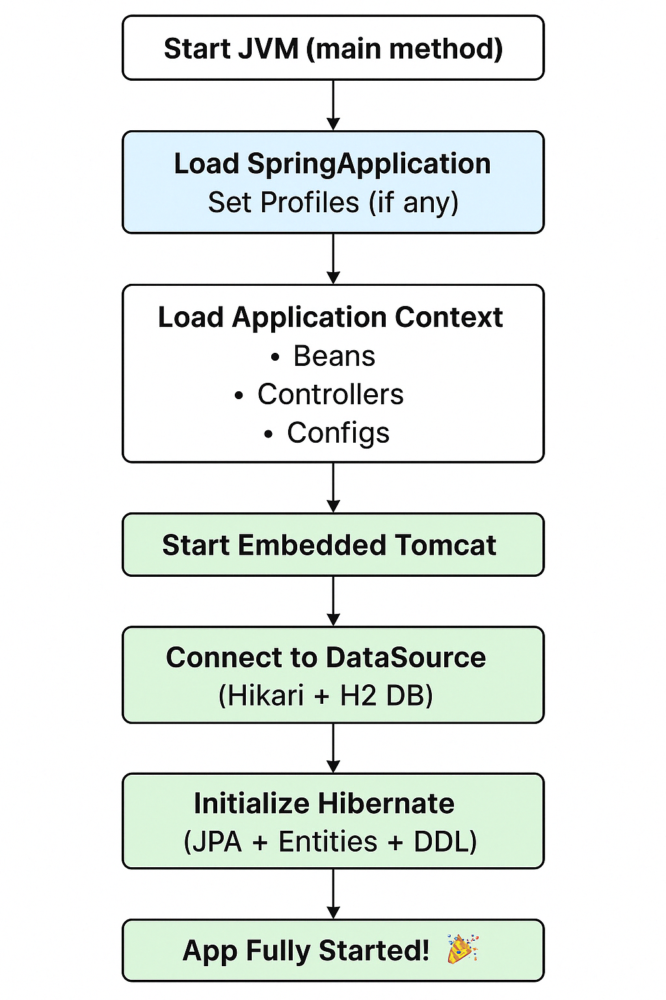

# Sovan-92-Hibernate-Tutorial

## Introduction 

Learning about hibernate and getting notes for everything. 

### How does a springboot application with HIbernate starts

## Hibernate Basics

### What is ORM 
Object relational Mapping. Use objects intead of SQL statements. 
### What is JPA
Java persistent API is provided by Oracle. It is a specification and aPI. 
Specification is for the vendors to provide implementation. API is for us to use the providers. 
One of the famous providers of JPA is Hibernate. Others are EclipseLink and Open JPA . 

JPA has the following class types. 

#### Classes

-EntityManager
-EntityMangerFactory

#### Annotation Columns
-Entity
-Table
-Id
-Column

### Why use spring Data JPA

Removes a lot of boiler plating from the Java persistent Api specification. 
Entity Object --> Database table with Enetity annotation
EmployeeRepository --> crudRepository Interface 

save
findOne
findAll
delete
count

Offers finder methods 

Paging and sorting 

JPQL 

### Generation Strategy 

- Auto - I am not sure , you decide based on underlying DB. 
- Identity - ORM increments the value based on previous
- Sequence  - Database sequence. MySql doesn't offer sequence. 
- Table - Look to the table and decide what's the next element
